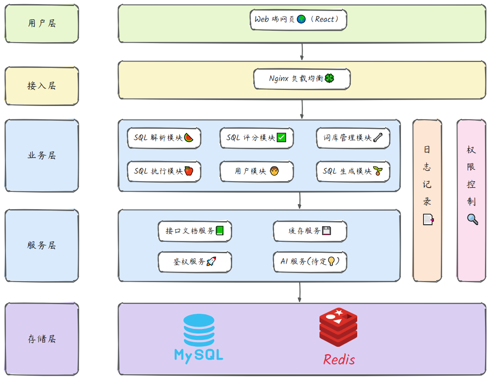
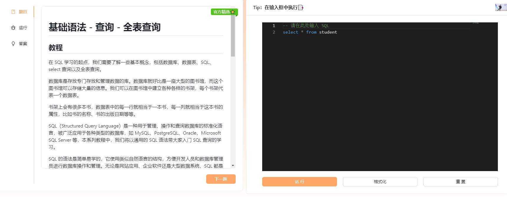
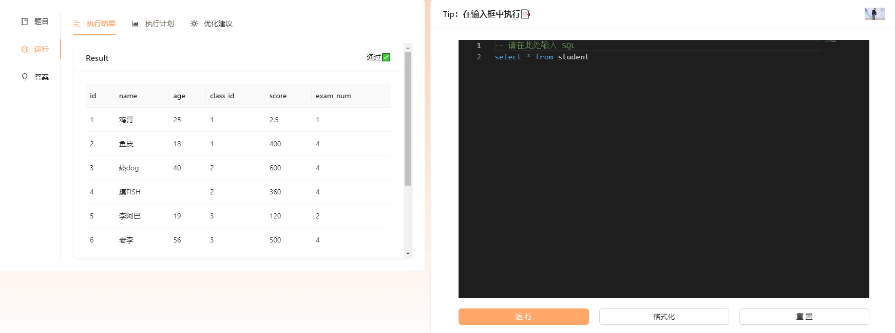
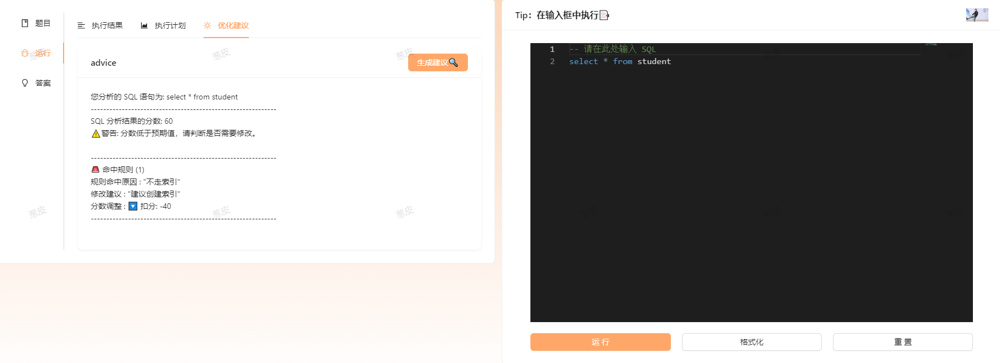
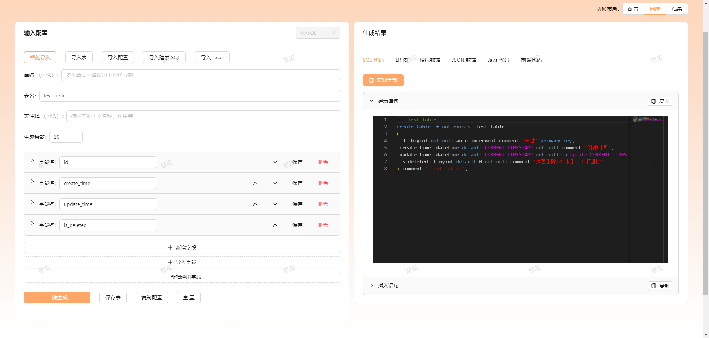

    

<h1 align="center">SQL Dog</h1>

<strong>基于 SpringBoot + MySQL + SQL 慢镜🔍（自研）致力于 SQL 刷题、SQL 解析，帮助人们解决 SQL 能力薄弱问题，帮助每个人成为 SQL 宗师🚀。。 <em>持续更新中～</em></strong>

    
    

## 项目介绍🚀

SQL Dog 是一款基于 SpringBoot + MySQL + SQL 慢镜🔍（自研）致力于 SQL 刷题、SQL 解析，帮助人们解决 SQL 能力薄弱问题，帮助每个人成为 SQL 宗师🚀。

## 架构设计图🎨

    

## 技术选型

### 前端

1. React
2. antd 组件库

### 后端

1. springBoot
2. MySQL
3. Redis
4. Sa-Token
5. sql-slow-mirror（自研 SQL 分析工具，项目地址：https://github.com/lhccong/sql-slow-mirror ）

## 做了哪些改进🔍

1. 生成的 Json 数据格式更加精准，之前只能生成 String 类型，现在能根据不同的字段类型进行生成。
2. 新增了 SQL 执行计划的分析，能让用户了解自己的 SQL 还有什么优化空间。
3. 整合了 sql-mother 、sql-father ，提供一站式 SQL 练习平台，练完 SQL 建 SQL，一站式服务。

## 需要攻克的点

1. 安全问题，防止用户 SQL 注入（使用`webassembly` 技术，在前端运行  SQLite  完成初始化）。
2. 如果不让用户之间的数据互相污染（前端使用  SQLite  完成初始化）。
3. 如何解析用户输入的 SQL（[ Druid ](https://github.com/alibaba/druid)）。

## 项目界面

### 做题

    

### 执行结果

    

### 优化建议

    

### 代码生成

    

### 表大全

    

### 选择关卡

    

### 用户信息

    

