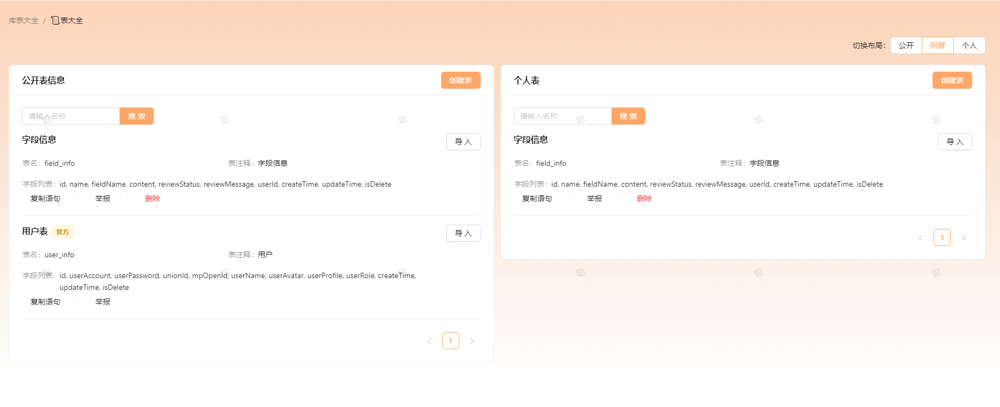
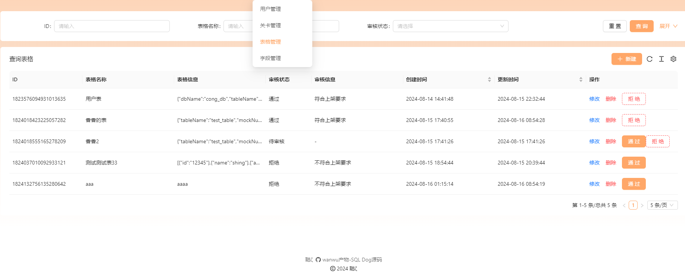

    

<h1 align="center">SQL Dog</h1>

<strong>基于 SpringBoot + MySQL + SQL 慢镜🔍（自研）致力于 SQL 刷题、SQL 解析，帮助人们解决 SQL 能力薄弱问题，帮助每个人成为 SQL 宗师🚀。。 <em>持续更新中～</em></strong>

    
    

## 项目介绍🚀

SQL Dog 是一款基于 SpringBoot + MySQL + SQL 慢镜🔍（自研）致力于 SQL 刷题、SQL 解析，帮助人们解决 SQL 能力薄弱问题，帮助每个人成为 SQL 宗师🚀。

## 架构设计图🎨

    

## 项目导航

- **快速体验地址**：[SQL Dog](https://codebug.icu)
- **前端项目仓库**：[sql-dog-frontend](https://github.com/lhccong/sql-dog-frontend)
- **后端项目仓库**：[sql-dog-backend](https://github.com/lhccong/sql-dog-backend)

## 做了哪些改进🔍

1. 生成的 Json 数据格式更加精准，之前只能生成 String 类型，现在能根据不同的字段类型进行生成。
2. 新增了 SQL 执行计划的分析，能让用户了解自己的 SQL 还有什么优化空间。
3. 整合了 sql-mother 、sql-father ，提供一站式 SQL 练习平台，练完 SQL 建 SQL，一站式服务。
4. 我们能生成 ER 图，通过 plantUML 代码的形式。
5. 后端开发遵循 TDD 开发模式，保证代码质量，使用 mock 来进行单元测试。

## 技术选型

### 前端

1. React
2. antd 组件库
3. webassembly
4. react-markdown
5. monaco-editor

### 后端

1. SpringBoot3.0
2. JAVA 17 
3. MySQL 
4. Redis 
5. Sa-Token（权限管理）
6. sql-slow-mirror（自研 SQL 分析工具，项目地址：https://github.com/lhccong/sql-slow-mirror ）
7. Druid（SQL 解析）

## 需要攻克的点

1. 安全问题，防止用户 SQL 注入（使用`webassembly` 技术，在前端运行  SQLite  完成初始化）。
2. 如果不让用户之间的数据互相污染（前端使用  SQLite  完成初始化）。
3. 如何解析用户输入的 SQL（[ Druid ](https://github.com/alibaba/druid)）。
### 环境搭建

#### 🎉后端环境搭建

后端项目使用 SpringBoot 开发，需要安装 JDK 17 、 MySQL 数据库、Redis。

在项目目录下的`application.yml`修改自己的启动环境`spring.profiles.active` = `dev`然后找到同级文件`application-dev.properties`，填写自己的环境配置(MySQL、Redis)。

#### 🎉 前端环境搭建

前端项目使用 React 开发，需要安装 Node.js（Node 18 版本，请保持一致） 、npm 。

在项目目录下执行`npm install`安装依赖，然后执行`npm run start`启动项目。
## 贡献者🤝
### 后端:

  

### 前端:

## 项目界面

### 做题

    

### 执行结果

    

### 优化建议

    

### 代码生成

    

### 表大全

    

### 选择关卡

    

### 用户信息

    

### 后台管理

    

## 致谢

感谢开源项目：

sql-father：https://github.com/liyupi/sql-father-backend-public

sql-mother：https://github.com/liyupi/sql-mother
